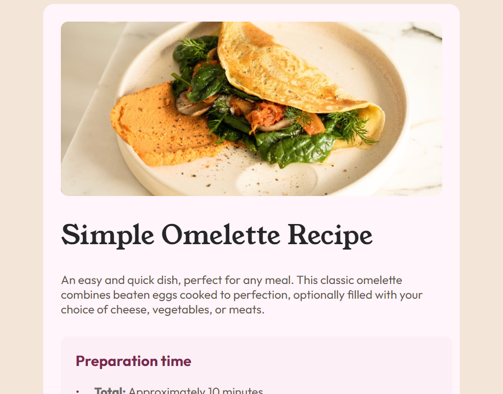
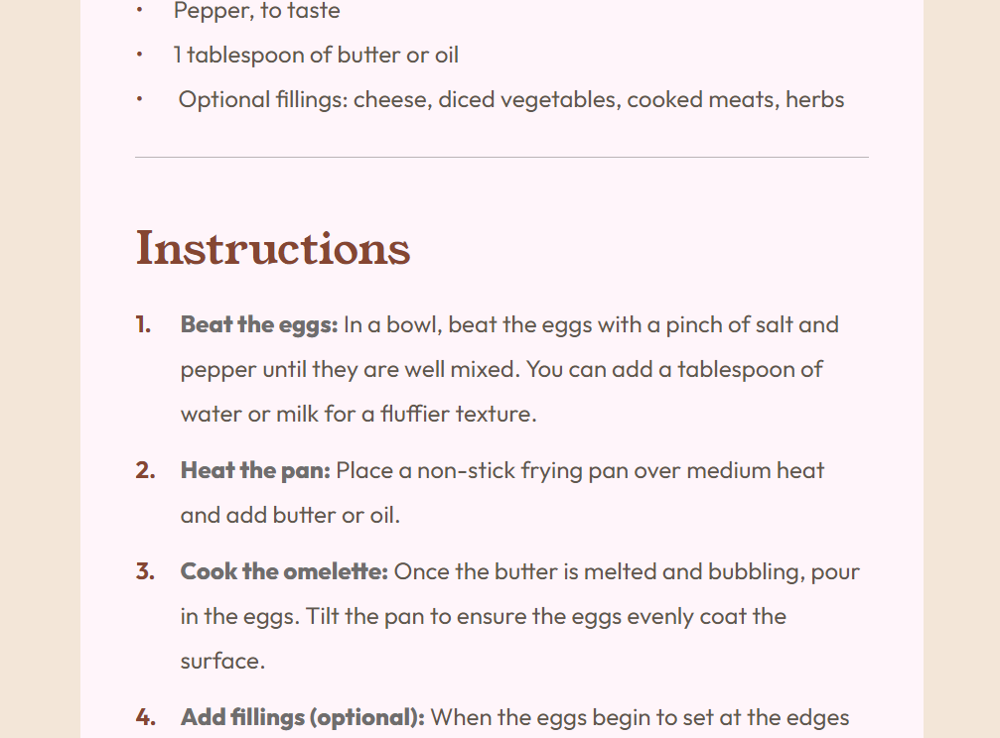
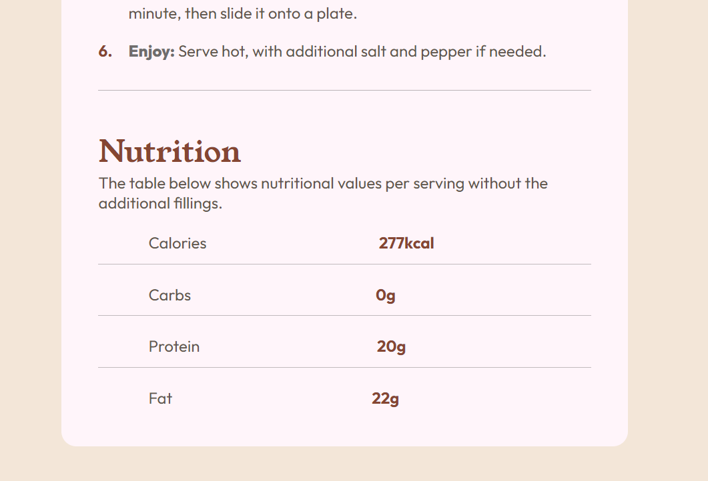

# Frontend Mentor - Recipe page solution

This is a solution to the [Recipe page challenge on Frontend Mentor](https://www.frontendmentor.io/challenges/recipe-page-KiTsR8QQKm). Frontend Mentor challenges help you improve your coding skills by building realistic projects. 

## Table of contents

- [Overview](#overview)
	- [Screenshot](#screenshot)
	- [Links](#links)
- [My process](#my-process)
	- [What I learned](#what-i-learned)
	- [Continued development](#continued-development)
- [Author](#author)

**Note: Delete this note and update the table of contents based on what sections you keep.**

## Overview

### Screenshot

### Links

- Solution URL: [Add solution URL here](https://github.com/qahsishaq/recipe-page-main)
- Live Site URL: [Add live site URL here](https://recipe-page-main-ishaq-ishaqs-projects.vercel.app/)

## My process
I spent longer than I expected on this project because I tried using bootstrap at first and I was unsuccessful owing to the predefined colours in bootstrap. I tried to override those colours but I got stuck! I ended up using purely HTML and CSS. Don't worry I'll still use bootstrap in my future projects.  
### What I learned

While reading documentations when I was trying to use bootstrap, I came across various frontend libraries like Sass. I learnt how easy it is to install, how it  works and the benefit it offers to developers. I can't wait to learn it!
### Continued development
Although I didn't use the table tag and other related tags, I improvised by creating a table that meets the criteria and looks like the design. I didn't use the table tag because I was not able to design the table to my taste. I had to improvise!  
I'd love to see other peoples' approach to creating that table
## Author

- Website - [qahsishaq](https://recipe-page-main-ishaq-ishaqs-projects.vercel.app/)
- Frontend Mentor - [@qahsishaq](https://www.frontendmentor.io/profile/qahsishaq)
- Twitter - [@qahs_I_I_shaq](https://x.com/qahs_I_I_shaq)
